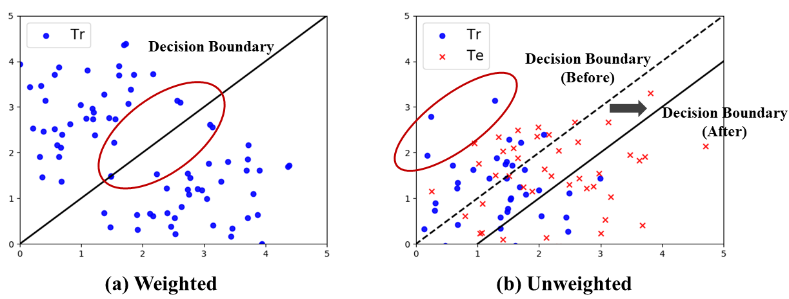
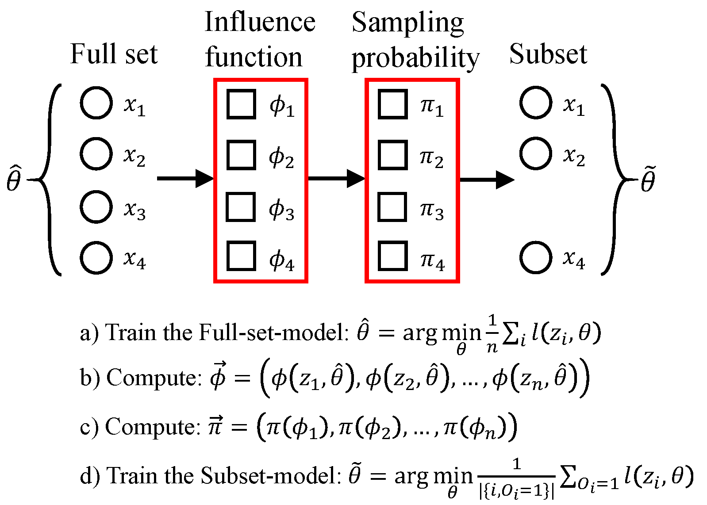

# Unweighted Influence Data Subsampling (UIDS)

This repository provides a numpy and scipy based implementation on *Unweighted Influence Data Subsampling* (UIDS) on the Logistic Regression model. The UIDS can achieve good result when the data set quality is not good, such as noisy labels, or there is distribution shift between training and test set, by dropping several bad cases.

## Paper

**Less Is Better: Unweighted Data Subsampling via Influence Function**

Zifeng Wang 1, Hong Zhu 2, Zhenhua Dong 2, Xiuqiang He 2, Shao-Lun Huang 1

1 Tsinghua-Berkeley Shenzhen Institute, 2 Noah's Ark Lab, Huawei

*34th AAAI Conference on Artificial Intelligence (AAAI)*, 2020


------

If you find this work interesting or helpful for your research, please consider citing this paper and give your star ^ ^


````latex
@inproceedings{wang2020influence,
  title={Less Is Better: Unweighted Data Subsampling via Influence Function},
  author={Wang, Zifeng and Zhu, Hong and Dong, Zhenhua and He, Xiuqiang and Huang, Shao-Lun},
  booktitle={Proceedings of the AAAI Conference on Artificial Intelligence},
  volume={1},
  pages={1--8},
  year={2020}
}
````


## Introduction

### Intuition Demonstration

In practice, it is common that some of the collected data are not good or even harmful for our model. Subsampling tries to build a tool to quantify each data’s quality, thereby keeping good examples and dropping bad examples to improve model’s generalization ability. Previous works concentrate on *Weighted* subsampling, that is, trying to maintain the model performance when dropping several data. 

By contrast, our work attempts to obtain a superior model by subsampling. 

The different between them can be shown as the image below:

<br/>
<p align="center"></p>
- **(a)** means if the blue points (training samples) within the red circle are removed, the new optimal decision boundary is still same as the former one

- **(b)** if removing blue points in the red circle, the new decision boundary shifts from the left, while achieves better performance on the Te set
<br/>

### Main Framework
<br/>
The main process of doing subsampling is as follows:
<p align="center"></p>
<br/>


## Usage & Demo

todo